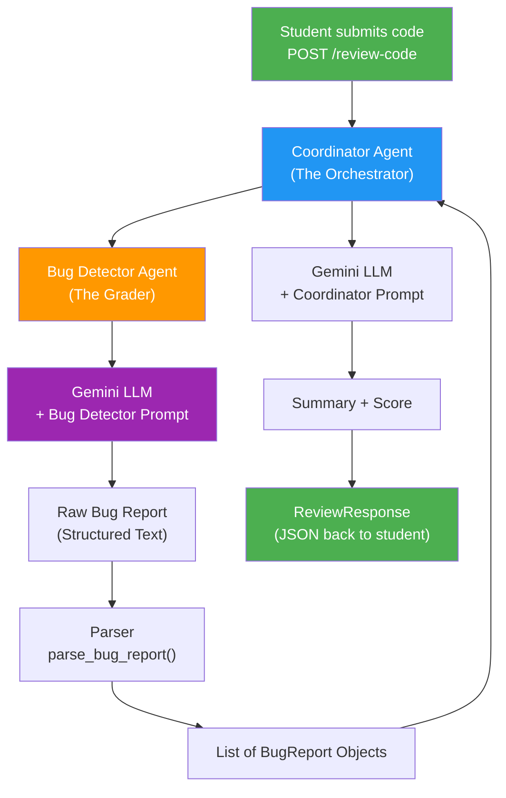
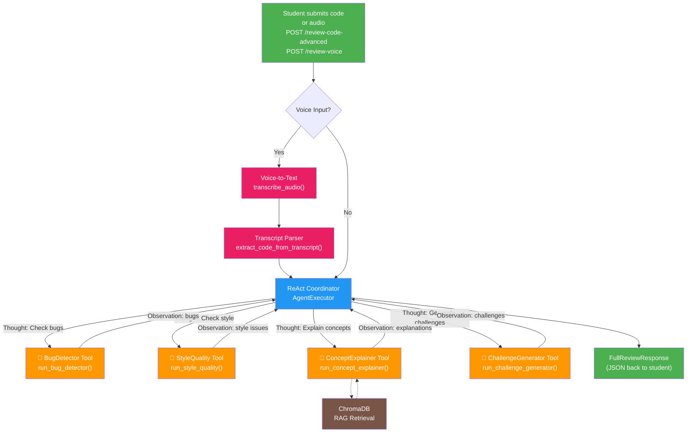

# CodeSensei — System Architecture

## Part 1: Basic Agent Flow (Eval 2)



---

## Part 2: Advanced ReAct Agent Flow (Capstone Extension)



### How ReAct Works

The Coordinator uses the **ReAct (Reason + Act)** loop — it thinks step by step, decides which sub-agent to call, observes the result, then decides what to do next. **No explicit graph needed.**

```
Thought: The user submitted Python code. I should first check for bugs.
Action: BugDetector
Action Input: python|||def factorial(n): return n * factorial(n)
Observation: Bug 1: Missing base case — will cause infinite recursion (Severity: critical)

Thought: Bug found. Now check style.
Action: StyleQuality
Action Input: python|||def factorial(n): return n * factorial(n)
Observation: Issue 1: Function name is fine, but no type hints or docstring

Thought: I have enough to generate an explanation and challenge now.
Action: ConceptExplainer
...
```

This is **transparent and debuggable** — students can see the reasoning trace directly in the terminal via `verbose=True`.

---

## Voice-to-Text Pipeline

```mermaid
flowchart LR
    A["🎤 Student speaks\ncode aloud"] --> B["Audio File\n(.wav/.mp3/.ogg)"]
    B --> C["POST /review-voice"]
    C --> D["Gemini Multimodal API\ntranscribe_audio()"]
    D --> E["Raw Transcript"]
    E --> F["LLM + Parser Prompt\nextract_code_from_transcript()"]
    F --> G["Extracted Code\n+ Context"]
    G --> H["Normal Review Pipeline\n(Basic or Advanced)"]

    style A fill:#E91E63,color:#fff
    style D fill:#9C27B0,color:#fff
    style F fill:#9C27B0,color:#fff
    style H fill:#2196F3,color:#fff
```



---

## Component Descriptions

### Part 1 Components

#### FastAPI App (`main.py`)
The web server that exposes the REST API. Handles HTTP requests, validates input using Pydantic, and returns JSON responses.

- **`GET /health`** — Health check, returns server status
- **`POST /review-code`** — Main endpoint, accepts code and returns a review

#### Coordinator Agent (`agents.py → run_coordinator`)
The orchestrator that manages the entire review pipeline:
1. Receives the student's code
2. Delegates bug detection to the Bug Detector
3. Assembles the final review with summary and score

#### Bug Detector Agent (`agents.py → run_bug_detector`)
Specialized agent focused solely on finding bugs:
1. Takes code + language as input
2. Uses a crafted PromptTemplate to instruct the LLM
3. Parses the structured output into BugReport objects

#### Pydantic Schemas (`schemas.py`)
Data validation layer ensuring type safety:
- **CodeReviewRequest** — Validates incoming API requests
- **BugReport** — Structured bug information
- **ReviewResponse** — Complete review output

#### Prompt Templates (`prompts.py`)
The "instructions" given to the LLM for each agent:
- **BUG_DETECTOR_PROMPT** — Tells the LLM how to find and report bugs
- **COORDINATOR_PROMPT** — Tells the LLM how to summarize and score

### Part 2 Components (Capstone Extension)

#### ReAct Coordinator (`agents.py → run_react_coordinator`)
Advanced orchestrator using LangChain's `AgentExecutor` with `create_react_agent`:
- Uses Reason + Act loops instead of a fixed pipeline
- Dynamically decides which tools to call and in what order
- Provides transparent reasoning traces

#### LangChain Tools (`tools.py`)
Wraps each agent function as a LangChain `Tool` for the ReAct coordinator:
- **BugDetector** — Finds bugs in code
- **StyleQuality** — Reviews naming, structure, best practices
- **ConceptExplainer** — RAG-powered concept explanations
- **ChallengeGenerator** — Creates follow-up coding exercises

#### Voice Module (`voice.py`)
Handles speech-to-code conversion:
- **`transcribe_audio()`** — Audio → text via Gemini multimodal API
- **`extract_code_from_transcript()`** — Natural language → formatted code

#### Extended Schemas (`schemas.py` Part 2)
New data models for the advanced pipeline:
- **StyleIssue** — Code style problem reports
- **ConceptExplanation** — Educational concept breakdowns
- **CodingChallenge** — Follow-up exercise definitions
- **FullReviewResponse** — Combined output from all agents
- **VoiceReviewRequest** — Audio upload metadata

---

## Updated Stack Summary

| Component | Technology |
|-----------|-----------|
| Agent orchestration | LangChain ReAct + AgentExecutor |
| Sub-agents | LangChain `Tool` wrappers |
| RAG pipeline | LangChain + ChromaDB |
| Memory | LangChain `ConversationBufferMemory` |
| LLM | Gemini via LangChain |
| Voice-to-Text | Gemini Multimodal API |
| Backend | FastAPI |
| Containerization | Docker + docker-compose |

---

## Lecture Mapping

| Component | Concepts From |
|-----------|--------------:|
| Environment setup, `.env`, `venv` | Lecture 2 |
| LangChain, PromptTemplate, Embeddings | Lecture 3 |
| LLM Chains, Memory patterns | Lecture 4 |
| Agent orchestration, multi-agent design | Lecture 5 & 6 |
| Docker containerization | Lecture 7 |
| FastAPI, REST endpoints, Pydantic | Lecture 8 |
