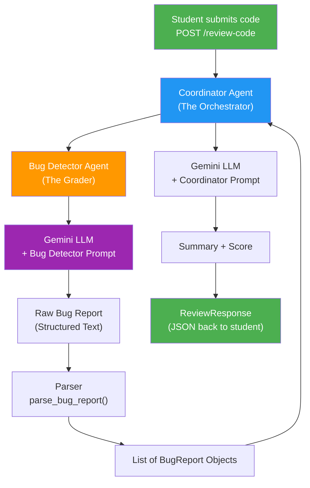

# CodeSensei — System Architecture

## Agent Flow



## Component Descriptions

### FastAPI App (`main.py`)
The web server that exposes the REST API. Handles HTTP requests, validates input using Pydantic, and returns JSON responses.

- **`GET /health`** — Health check, returns server status
- **`POST /review-code`** — Main endpoint, accepts code and returns a review

### Coordinator Agent (`agents.py -> run_coordinator`)
The orchestrator that manages the entire review pipeline:
1. Receives the student's code
2. Delegates bug detection to the Bug Detector
3. Assembles the final review with summary and score

### Bug Detector Agent (`agents.py -> run_bug_detector`)
Specialized agent focused solely on finding bugs:
1. Takes code + language as input
2. Uses a crafted PromptTemplate to instruct the LLM
3. Parses the structured output into BugReport objects

### Pydantic Schemas (`schemas.py`)
Data validation layer ensuring type safety:
- **CodeReviewRequest** — Validates incoming API requests
- **BugReport** — Structured bug information
- **ReviewResponse** — Complete review output

### Prompt Templates (`prompts.py`)
The "instructions" given to the LLM for each agent:
- **BUG_DETECTOR_PROMPT** — Tells the LLM how to find and report bugs
- **COORDINATOR_PROMPT** — Tells the LLM how to summarize and score

## Data Flow

```
Request JSON -> Pydantic Validation -> Coordinator Agent
                                        |
                                  Bug Detector Agent
                                        |
                                   Gemini LLM Call
                                        |
                                  Parse Response
                                        |
                                  Coordinator LLM Call
                                        |
                                  ReviewResponse -> JSON
```

## Lecture Mapping

| Component | Concepts From |
|-----------|--------------|
| Environment setup, `.env`, `venv` | Lecture 2 |
| LangChain, PromptTemplate, Embeddings | Lecture 3 |
| LLM Chains, Memory patterns | Lecture 4 |
| Agent orchestration, multi-agent design | Lecture 5 & 6 |
| FastAPI, REST endpoints, Pydantic | Lecture 8 |
